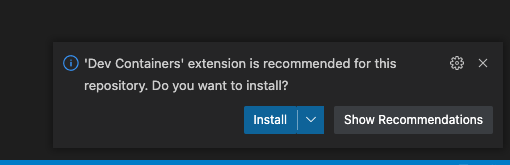
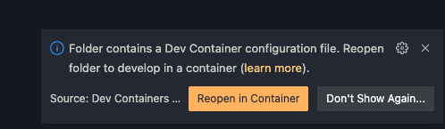
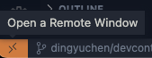

# CATcher Product Site

# Setting up 
This section guides you through the steps required to set up a development container using `Docker` and `VSCode` for developing CATcher's user guide site.

## Prerequisites
Install the following programs:

- [VSCode](https://code.visualstudio.com/) / [VSCodium](https://vscodium.com/)
- [Docker Desktop](https://www.docker.com/)

## Getting Started

1. Open the folder in VSCode. The Dev Containers extension should be recommended. 
   1.  Click on **Install**
   2. Ensure that you follow the installation guide for the extension pack as well, especially for operating system-specific steps.
2.  Click **Reopen in Container**
   1.   Or click the _double arrow icon_ in the bottom left of the window.
   2. Select **Reopen in Container**
3. After container build, press any key to access shell.
4. You may start the application with `markbind serve`

> If you encounter `Error: Cannot find module '/home/vscode/.vscode-server/data/User/workspaceStorage/a58265afe7bacfc76c46ea6bab19d711/ms-vscode.js-debug/bootloader.js'`
> 1. Open `"debug.javascript.autoAttachFilter": "disabled"` in User Settings
> 2. Toggle settings to anything valid, pausing a few moment between each change.
> 3. Try again
>
> Dev Containers seem to still be rather stateful. Fix taken from [here](https://www.davidwesst.com/blog/missing-bootloader-in-vscode-devcontainer/). Good news is the error does not show up unless you rebuild the container.

### Git Settings

Follow official documentation [here](https://code.visualstudio.com/docs/remote/containers#_sharing-git-credentials-with-your-container)

# Setting up \[alt\]
This section guides you through the steps required to set up a local development environment for developing CATcher's user guide site.

## Prerequisites

You need Node 12 to develop this project. 
Run `node -v` in your OS terminal to check the version of Node on your computer. 

If you do not have Node 12 installed in your computer, click on [this link](https://nodejs.org/en/blog/release/v12.20.0/) to download Node 12. 

## Getting Started

1. Fork this repository into your Github account.

2. Clone the forked repository into your computer.

3. Install Markbind with npm: Run `npm install -g markbind-cli`.

4. Compile and start the application: Run `markbind serve`.
    - **Note**: If this step fails, it may be possible that the port that `Markbind` is attempting to serve the site in is being used. This may be rectified with the following command: `markbind serve -p <available_port>`.
