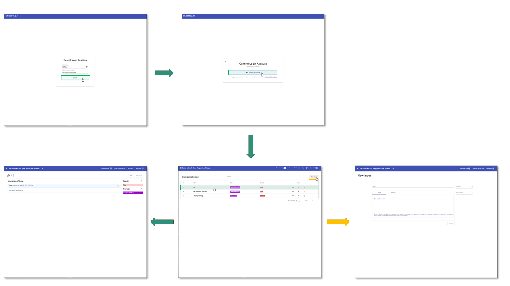
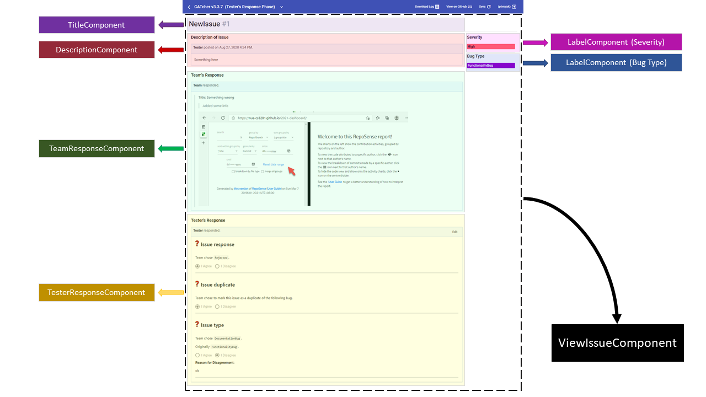

<frontmatter>
  header: header.md
  title: "DG: Design"
  pageNav: 2
  siteNav: dg-nav.md
  footer: footer.md
</frontmatter>

# Design

As described in the [_Tools_](tools.md) section, CATcher is an Angular application that is distributed both as a web and a desktop app. From a design perspective, there are no major differences between
both versions.

This page describes CATcher's design. As an Angular application, the different
views of the CATcher app are built out of **components**, and the content displayed on these
views is constructed using data provided by **services**. We describe the design of the views and services in the following sections.

## Views

There are only a few views accessible by the user, in each phase of the practical exam.

The diagram below shows how a user can navigate between the different views in the bug reporting phase.

Each view is built out of components.
As an example, the following diagram deconstructs the `ViewIssueComponent`, which is used to display / update details about a bug report (i.e. the title, tester's original report, team's response, etc), to show how it is built using several smaller components.
For instance, the `TitleComponent`, a child component of `ViewIssueComponent`, is responsible for
displaying / updating the bug report's title.

## Services

Services are classes that define business logic or communicate with the app's backend (GitHub). For ease of understanding, we have distinct services for the different types of data exchanged with the backend. Below are some examples:

- IssueService: Responsible for creating / updating issues, and periodically fetching issues from GitHub
- AuthService: Responsible for starting the authentication process, and querying / updating application state related to authentication
- LabelService - Responsible for ensuring the GitHub repo has the required labels, and providing label data to various components

Under the hood, several services use the `GitHubService` to communicate with GitHub.
The `GitHubService` abstracts the details of communication with GitHub, away from the other services.
