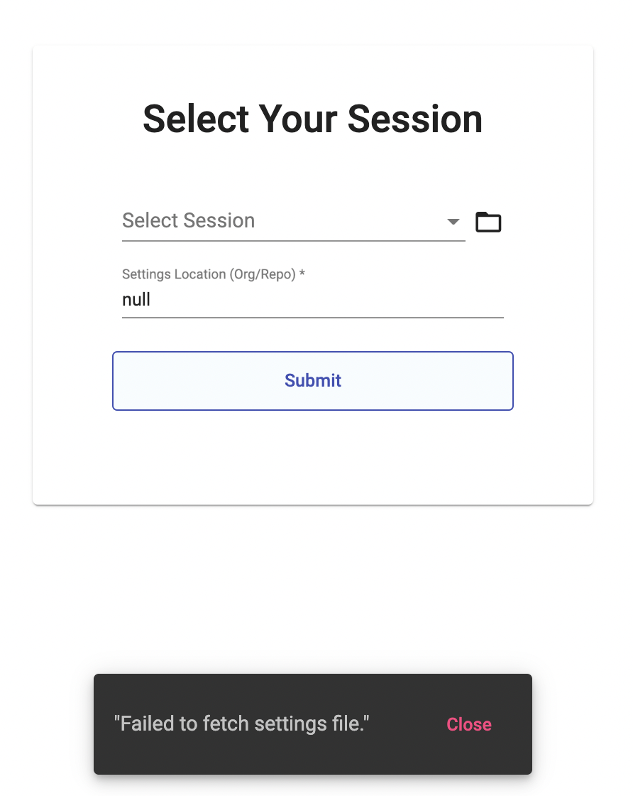

<frontmatter>
  header: header.md
  title: "DG: Setting up"
  pageNav: 2
  siteNav: dg-nav.md
  footer: footer.md
</frontmatter>

# Setting up

This section guides you through the steps required to set up your computer for developing CATcher.

## Getting started

**Prerequisites:**
* [Node.js 14](https://nodejs.org/en/blog/release/v14.21.2/) -- (run `node -v` in your OS terminal to check the version of Node on your computer)

**Recommended:**
* IDE: Visual Studio Code

**Steps:**
1. Fork this repository into your Github account.
2. Clone the forked repository into your computer.
3. Install dependencies with npm: Run `npm install`
    - *a list of warnings is expected and no action needs to be taken before proceeding.*
4. Compile and start the application in browser: Run `npm run ng:serve:web`.

-----------------------------------------------------------------------------------

## Dev commands

Given below are different commands you can use to run the app locally.

|Command|Description|
|--|--|
|`npm start`| ~~Start the app from Electron in development mode.~~ |
|`npm run ng:serve:web`| Start the app from the browser in development mode. |

*Note: we are currently moving towards web-only application and therefore Electron is currently not supported.*

-----------------------------------------------------------------------------------

## Debugging

If you are using Visual Studio Code to debug CATcher with Chrome, Firefox or Edge.
Refer to the `Debugging Angular` section of [this guide](https://code.visualstudio.com/docs/nodejs/angular-tutorial#_debugging-angular) for a step-by-step walkthrough of the debugger setup.

In summary, the following steps are needed:

1. Install the `Debugger for Chrome` extension for VS Code. You can also install debugger extensions for Firefox and Edge.
1. Create VS Code's debugger config file (`launch.json` ) as shown in [the guide](https://code.visualstudio.com/docs/nodejs/angular-tutorial#_debugging-angular). Particularly, set the `url` attribute to `http://localhost:4200` (reason: CATcher app is served locally on port 4200, by default.)
1. In the root project folder, run `npm run ng:serve:web`.
1. In VS Code's Debug View, launch the debugger by clicking the green arrow (or F5). You should see the CATcher app loading within a new browser window.

-----------------------------------------------------------------------------------

## Writing Documentation

**CATcher documentation is hosted in a separate repo** [CATcher-org/catcher-org.github.io](https://github.com/CATcher-org/catcher-org.github.io).
When you need to update documentation, you'll need to fork and clone that repo to your computer as well.

**We use [MarkBind](https://markbind.org/) for documentation**. Follow [this tutorial](https://se-education.org/guides/tutorials/markbind.html) to learn how to use MarkBind for updating project documentation.

-----------------------------------------------------------------------------------

## Tasks To Self-Test Knowledge

These tasks assume a basic understanding of `Angular` and `TypeScript`.
If you wish to know more about them, you can visit our [tools page](tools.html).

### Backend

<panel header="**Task 1: Add new label**" type="primary">
  
  **Task 1: Add new label `type.UiFlaw`**

  Currently, there are only 3 types of bugs in CATcher: `type.DocumentationBug`, `type.FeatureFlaw` and `type.FunctionalityBug`. Let's add a fourth one, `type.UiFlaw` to understand the backend.

  **Your Task**

  Add a new label `type.UiFlaw` to the existing list of labels. You may choose a color and a definition to your liking.

  <panel header="Hint 1" type="info">

  First, you need to locate the files responsible for labels. Note that this is a backend task, so it is unlikely to be an Angular component.

  </panel>
  <panel header="Hint 2" type="info">

  You may encounter 2 files that handle labels: `label.service.ts` and `label.model.ts`. `label.model.ts` contains the class responsible for Labels. It does not contain the list of labels used in CATcher. Therefore, look into `label.service.ts`.

  </panel>
  <panel header="Hint 3" type="info">

  In `label.service.ts`, you will see how the various labels are defined. Can you emulate the other labels and add the new label?

  </panel>

  <panel header="Suggested solution" type="info">

  In `label.service.ts`, you should declare a new definition of `type.UiFlaw`, then add it to the `LABEL_DEFINITIONS` and `REQUIRED_LABELS` under `REQUIRED_LABELS['type']['UiFlaw']`.

  See the changes [here](https://github.com/chunweii/CATcher/commit/e34cc70be83ad14ed5bde0e6941894f0d76c03bd).

  </panel>
</panel>

<panel header="**Task 2: Delete labels that are not in use**" type="primary">

  **Task 2: Delete labels that are not in use**

  Upon creation of a new repository, Github will automatically create default labels, which we may not use in CATcher. The user might also have added other labels on their own.
  
  **Your task**
  
  Add a feature to delete all labels that are not required by CATcher upon login.

  <panel header="Hint 1" type="info">

  Similar to the first task, one of the files responsible for this feature is `label.service.ts`. However, we need to interact with the Github API to delete labels. Can you find which service is responsible for handling Github API calls? 

  </panel>
  <panel header="Hint 2" type="info">

  Refer to the <tooltip content="The version of octokit may differ. The version used by CATcher can be found in `package.json`."><a target="none" href="https://octokit.github.io/rest.js">octokit documentation</a></tooltip> for details on which Github API call to use.

  </panel>
  <panel header="Suggested solution" type="info">

  1. Create a new method `deleteLabel(labelName)` in `github.service.ts`. Call the <tooltip content="See [the octokit docs](https://octokit.github.io/rest.js/v18#issues-delete-label)">octokit function</tooltip> to delete label.

  2. In `label.service.ts`, edit the private `LabelService.ensureRepoHasRequiredLabels(actualLabels, requiredLabels)` method, by iterating through `actualLabels` and deleting every label in `actualLabels` that are not present in `requiredLabels`.

  Refer [here](https://github.com/chunweii/CATcher/commit/eb38328b263aa08376fb6e5e47b83c4a07d00650) for the full changes.

  </panel>

</panel>


### Frontend

<panel header="**Task 1: Make error snack bars automatically close**" type="primary">

  **Task 1: Make error snack bars automatically close**

  

  1. To help you see the error snack bar, first launch `CATcher` locally.
  2. Enter `null` inside the Settings Location input and click submit.
  3. On the bottom of your browser, a pop-up "Failed to fetch settings file." should appear.
  4. You will see that it doesn't close by itself; you have to manually click the close button.

  **Your Task**

  Make the error snack bar disappear automatically, after being displayed for 3 seconds.

  <panel header="Hint 1" type="info">

  First, you need to locate the files responsible for error handling.
  When searching for the relevant files, it is useful to know the name of the frontend component involved.
  In this task, the name of the frontend component is `MatSnackBar`. Try to find out where it's used.
  For more information on `MatSnackBar`, you can read the documentation [here](https://material.angular.io/components/snack-bar/overview).

  </panel>

  <panel header="Hint 2" type="info">

  You should find that our related file is `error-handling.service.ts`.
  All that's left is to figure out how to tell `snackBar` to close after a certain amount of time.
  There are multiple ways to do this. One way is to use `setTimeout` function on the `snackBarRef.dismiss()` like this:
  ```typescript
  const snackBarRef = this.snackBar.openFromComponent(GeneralMessageErrorComponent, {data: error});
  setTimeout(() => {
    snackBarRef.dismiss();
  }, this.snackBarAutoCloseTime);
  ```

  </panel>

  <panel header="Suggested solution" type="info">

  There is more than 1 way to achieve this. By combining the changes in hint 1 and hint 2, you should be able to reach a solution.
  <panel header="error-handling.service.ts" type="success">

  ```typescript
  import { ErrorHandler, Injectable } from '@angular/core';
  import { MatSnackBar, MatSnackBarRef } from '@angular/material';
  import { GeneralMessageErrorComponent } from '../../shared/error-toasters/general-message-error/general-message-error.component';
  import { FormErrorComponent } from '../../shared/error-toasters/form-error/form-error.component';
  import { HttpErrorResponse } from '@angular/common/http';
  import { RequestError } from '@octokit/request-error';
  import { LoggingService } from './logging.service';

  export const ERRORCODE_NOT_FOUND = 404;

  const FILTERABLE = ['node_modules'];

  @Injectable({
    providedIn: 'root',
  })
  export class ErrorHandlingService implements ErrorHandler {
    snackBarAutoCloseTime = 3000;

    constructor(private snackBar: MatSnackBar, private logger: LoggingService) {}

    handleError(error: HttpErrorResponse | Error | RequestError, actionCallback?: () => void) {
      this.logger.error(error);
      if (error instanceof Error) {
        this.logger.error(this.cleanStack(error.stack));
      }
      if (error instanceof HttpErrorResponse || error instanceof RequestError) {
        this.handleHttpError(error, actionCallback);
      } else {
        this.handleGeneralError(error.message || JSON.stringify(error));
      }
    }

    private addAutoClose<T>(snackBarRef: MatSnackBarRef<T>) {
      setTimeout(() => {
        snackBarRef.dismiss();
      }, this.snackBarAutoCloseTime);
    }

    private cleanStack(stacktrace: string): string {
      return stacktrace
              .split('\n')
              .filter(line => !FILTERABLE.some(word => line.includes(word))) // exclude lines that contain words in FILTERABLE
              .join('\n');
    }

    // Ref: https://developer.github.com/v3/#client-errors
    private handleHttpError(error: HttpErrorResponse | RequestError, actionCallback?: () => void): void {
      let snackBarRef = null;
      // Angular treats 304 Not Modified as an error, we will ignore it.
      if (error.status === 304) {
        return;
      }

      if (!navigator.onLine) {
        snackBarRef = this.handleGeneralError('No Internet Connection');
        this.addAutoClose(snackBarRef);
        return;
      }

      switch (error.status) {
        case 500: // Internal Server Error.
          snackBarRef = this.snackBar.openFromComponent(GeneralMessageErrorComponent, {data: error});
          break;
        case 422: // Form errors
          snackBarRef = this.snackBar.openFromComponent(FormErrorComponent, {data: error});
          break;
        case 400: // Bad request
        case 401: // Unauthorized
        case 404: // Not found
          snackBarRef = this.snackBar.openFromComponent(GeneralMessageErrorComponent, {data: error});
          break;
        default:
          snackBarRef = this.snackBar.openFromComponent(GeneralMessageErrorComponent, {data: error});
      }

      if (snackBarRef) {
        this.addAutoClose(snackBarRef);
      }
    }

    private handleGeneralError(error: string): void {
      const snackBarRef = this.snackBar.openFromComponent(GeneralMessageErrorComponent, {data: {message: error}});
      this.addAutoClose(snackBarRef);
    }
  }
  ```

  </panel>

  </panel>

</panel>
