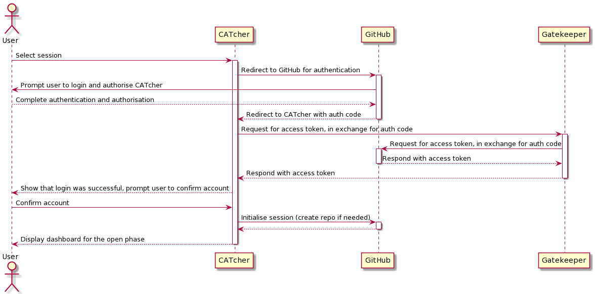

<frontmatter>
  header: header.md
  title: "DG: Tool stack"
  pageNav: 2
  siteNav: dg-nav.md
  footer: footer.md
</frontmatter>

# Tools

This page introduces you to some important tools/frameworks used by CATcher.

-------------------------------------------------------------------

## Type Script

Type Script is the main programming language used.

-------------------------------------------------------------------

## Angular

**Angular is a TypeScript-based web application framework.** CATcher is built using Angular and hence our codebase is in Typescript. It is recommended that you familiarise yourself with Typescript as well as Angular before you attempt to work on CATcher.

**An Angular application is largely made up of Components, Services, and the corresponding HTML and CSS files for each Component.** A Component is a direct representation of visible aspects of an application, while a Service provides useful functionalities to Components where needed. The separation of components and services increases modularity and reusability, as through dependency injection (DI), the service class can provide services to different parts of the application. For more details on the structure of Angular, visit the Angular Guide via the links below. It is also recommended for new developers to do a brief walkthrough of the Angular tutorial (link below) before attempting any fixes on CATcher.

**The RxJS (Reactive Extensions for Javascript) Library** is part of Angular that supports reactive programming for Javascript. This means that it enables the application to respond to changes in data readily, by allowing instant propagation of changes throughout the application. RxJS library provides support for asynchronous programming through `Observables`, `Observers` as well as `Promises`. `Observers` are able to receive updates on changes to the `Observables` they are observing, which allows instant updates throughout the application through the use of these objects.

**_Pipes_ are also frequently used in CATcher** to reduce clutter and improve readability of our codebase. It strings together operators in a sequence such that the operators can be applied to the given value in order.

Example of custom operators using pipes in CATcher:
```
export function assertSessionDataIntegrity() {
   return pipe(
     throwIfFalse(sessionData => sessionData !== undefined,
       () => new Error('Session Data Unavailable')),
     throwIfFalse(isSessionDataCorrectlyDefined,
       () => new Error('Session Data is Incorrectly Defined')),
     throwIfFalse(hasOpenPhases,
       () => new Error('There are no accessible phases.')));
 }
```

****Resources:****

1. [Angular Guide](https://angular.io/guide/architecture) : Official Angular developer guide and introduction to basic Angular topics
2. [RxJS Guide](https://rxjs-dev.firebaseapp.com/guide/observable) : Official RxJS guide on Observables, Observers, Operators, Subscription, etc.
3. [Angular Guide on Navigation of Component Tree](https://angular.io/guide/dependency-injection-navtree) : Guide on how to navigate the component tree with Dependency Injection
4. [Angular Tutorial](https://angular.io/tutorial) : Official Angular tutorials

-------------------------------------------------------------------

## GraphQL

GraphQL is a query language for APIs.

In CATcher, it is to communicate with the Github backend. It allows us to define a schema for the data that we receive from github, and also performs validation for the data we reqeust for, such that the data we receive from Github is exactly what we need, nothing more, nothing less. The extra layer of GraphQL is one that makes the process of data retrieval in CATcher more streamlined.

The GraphQL queries used by CATcher are defined under the `graphql` folder in the codebase.

-------------------------------------------------------------------

## OAuth 2.0

CATcher uses the OAuth 2.0 protocol to authenticate users. Below is a summary of the authentication process:

1. A user launches CATcher, and is prompted to log into GitHub. This is a direct interaction between the user and GitHub. Once the user has logged in, GitHub provides CATcher with an authorization code meant for this user.

2. CATcher sends this authorization code and its own client secret to GitHub's authorization server - in exchange for an access token.

3. Authentication is complete, and CATcher can now use the access token when it uses the GitHub API for its logic (e.g. submitting new issues, editing existing issues)

The authentication process is kicked off in the `AuthComponent`, but the code that co-ordinates steps 1 and 2 can be found in `AuthService`. Step 2 requires a client secret granted to CATcher. To protect this, we run a web service, [gatekeeper](https://github.com/CATcher-org/gatekeeper) that executes step 2 on behalf of the client CATcher app. More details on Github's OAuth implementation can be found [here](https://docs.github.com/en/developers/apps/building-oauth-apps/authorizing-oauth-apps)

The sequence diagram below shows the OAuth flow for the CATcher web app.
<br/><br/><br/>


<box type="info">
    The gatekeeper web service is managed and deployed seperately using heroku. This service is required due to security-related limitations imposed by Github, that prevent developers from implementing the OAuth Web Application Flow on a client-side only application. CATcher team is also responsible for managing the deployment of our gatekeeper service accordingly.
    <br/><br/>
    In the scenario where you are required to redeploy catcher-auth, you will need access as a collaborator on heroku to catcher-auth, do reach out to the project owner to be added as a collaborator.
</box>
-------------------------------------------------------------------

## Testing tools

Described in the [Testing](testing.md) page.