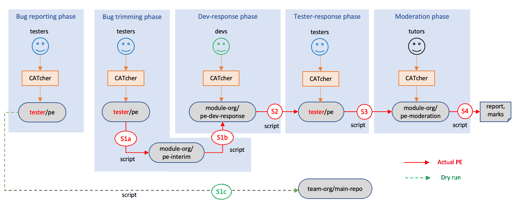

<frontmatter>
  header: header.md
  title: "DG: User workflow"
  pageNav: 2
  siteNav: dg-nav.md
  footer: footer.md
</frontmatter>

# User workflow

## Overview

The diagram below shows what happens in various phases of a CATcher-assisted <tooltip content="i.e., Practical Exam">PE</tooltip>.



Here is a brief explanation of each phase:

1. **Bug reporting phase**
   1. Student testers test the software they have been assigned and report bugs through CATcher.
      These bugs are stored in a repo in the tester's GitHub account. e.g., `tester/pe`.
1. **Bug trimming phase**
   1. Student testers use CATcher to trim down the number of bugs reported, leaving only the most significant bugs. Student testers can also update the severity and type label to best fit the nature of the reported bug.
      These bugs are stored in the same repo as `Bug reporting phase`.
   1. After the testing session is over, a script `S1a` transfers the bugs to an interim private repository (e.g., `module-org/pe-interim`), and another script `S1b` transfers the bugs from the interim repo to a central repo e.g., `module-org/pe-dev-response`.<br>
      Bugs are channelled through an interim repo to hide the identity of the tester.<br>
      Scripts used to transfer/process bugs between phases are not part of CATcher codebase at the moment. They are managed separately by teaching staff members.

   <box type="info" seamless>

   During the PE dry run (which has only one phase and the anonymity is not required), the script `S1c` transfers bugs directly to the receiving team's issue tracker.
   </box>
1. **Dev response phase**
   1. Dev teams (i.e., teams that developed the target products) use CATcher to respond to bugs they received.
   1. At the end, a script `S2` transfers dev team's response back to the original bug reports in the tester's GitHub account e.g., `tester/pe`.
1. **Tester response phase**
   1. Testers use CATcher to provide their own response to the dev team's response.
   1. At the end, a script `S3` transfers the tester's response to another private repository e.g., `module-org/pe-moderation` that tutors can access.
1. **Moderation phase**
   1. Tutors give their own inputs on bugs that caused disputes between the tester and the dev team.
   1. At the end, a script `S4` generates a final report and marks.


**The _settings_ repo**: CATcher behavior for the above phases are dictated by config data stored in a public repository we call the _settings_ repo e.g., `module-org/pe`.

More detail of the things mentioned above are given in the sections below.

---

## The _settings_ repo

* Each PE must have its own settings repo, which is a public repository containing config data that govern the behavior of CATcher e.g., which phase is open, which students are taking part, names used for various repos etc.<br>
  For example, the module instructor can _open_ a phase (i.e., allow students to do that phase through CATcher) by modifying the `settings.json` file in the settings repo.
* An example https://github.com/nus-cs2103-AY2021S2/pe
* The settings repo is also used to hold files uploaded by students (e.g., screenshots). CATcher initially uploads those files to the same repo that holds the bug. But our scripts copy those files to the settings repo so that the identity of the uploader cannot be discovered using the file URL.

---

## Bug Reporting Phase

### [CATcher] Collect Bug Reports

* Title and body as the tester entered.
* Labels: `severity.*`, `type.*` (both compulsory)

---

## Bug Trimming Phase

### [CATcher] Trim Bug Reports

* Disable editing of Title and body.
* Close issue when issue deleted in CATcher, re-open issue when issue recovered in CATcher
* Editable Labels: `severity.*`, `type.*` (both compulsory)

### [Script `S1a`] Tester-Repo → Interim-Repo

<box type="info" seamless>

Issue title remains the same as the original issue, throughout the workflow
</box>

<panel type="seamless" header="Formats used">

Issue body:
```
{original issue description}

<hr>
<sub>[original: username/interim-repo-name#issue-number]</sub>
```
Example:

```
The app doesn't work

<hr>
<sub>[original: johnDoe/pe#1234]</sub>
```

</panel>

Notes:
* Only open issues are to be transferred.
* Copy the `severity.*` label. If no severity label, apply `severity.Low`
* Copy the `type.*` label.
* Transfer image files to the settings repo (public) and update the link in the issue body.
* Check the timestamp. Only bugs reported within the PE period should be transferred. Add a comment to issues falling outside the accepted time window.
  >Bug report not accepted as it was modified outside the time window `{start time}-{end time}`


### [Script `S1b`] Interim-Repo → Dev-Repo

<panel type="seamless" header="Formats used">

Body:
```
{issue description: same as interim}

<hr>
<sub>[original: module-org/interim-repo-name#issue-number]</sub>
```
</panel>

Notes:
* Copy all labels
* Apply the correct `tutorial.*` label and `team.*` label to indicate the receiving team


### [Script `S1c`] In the dry run: Tester-Repo → Team-Repo

* Transfer the bug report to the respective team repo.
* Labels are to be omitted (as the script doesn't have permission to add labels in team's repo) but mentioned in the body of the issue (for reference).
* Image links can be kept as they are, as tester anonymity is not required.

---

## Dev Response Phase

### [CATcher] Collect Dev Response

<panel type="seamless" header="Formats used">

Body:
```
{same as interim repo}
```
Add a comment:

<div id="team-response-format">

```
# Team's Response

{team's response}

## Duplicate status (if any):
Duplicate of #{issue-number}
```
Example:

```
# Team's Response
Yes, we missed this.
But it's a minor bug.

## Duplicate status (if any):
Duplicate of #1234
```
</div>
</panel>

* Labels: `severity.*`, `type.*`, `response.*`, `duplicate`

### [Script `S2`] Dev-Repo → Tester-Repo

Add a comment to the original issue in `tester/repo-name`, in the following format:

<panel type="seamless" header="Formats used" id="tester-response-format">

```
# Team's Response

{team's response}

# Items for the Tester to Verify
## :question: {type of verification}

{description}

- [ ] I disagree

**Reason for disagreement:** [replace this with your reason]

<catcher-end-of-segment><hr>
```
Example:

```
# Team's Response

Description of team's response
# Items for the Tester to Verify
## :question: Issue response

Team chose [`response.Rejected`]

- [ ] I disagree

**Reason for disagreement:** [replace this with your reason]

<catcher-end-of-segment><hr>
## :question: Issue severity

Team chose [`severity.Low`]

Originally [`severity.High`]

- [ ] I disagree

**Reason for disagreement:** [replace this with your reason]

<catcher-end-of-segment><hr>
## :question: Issue type

Team chose [`type.DocumentationBug`]

Originally [`type.FunctionalityBug`]

- [ ] I disagree

**Reason for disagreement:** [replace this with your reason]

<catcher-end-of-segment><hr>
```
</panel>

Notes:
* If the issue is a duplicate, it should be considered as using severity, type, and response from the "original" issue.
* If the `response.*` is missing, add `response.Accepted` to the destination issue (not the source issue).
* If the dev response contains images, they need to be transferred to the settings repo as well

---

## Tester Response Phase

### [CATcher] Collect Tester Response

Update the comment.

<panel type="seamless" header="Formats used">

Example:

```
## :question: Issue type

Team chose [`type.DocumentationBug`]

Originally [`type.FunctionalityBug`]

- [x] I disagree

**Reason for disagreement:** It's a bug, not a typo.

<catcher-end-of-segment><hr>
```
</panel>

### [Script `S3`] Tester-Repo → Tutor-Repo

<panel type="seamless" header="Formats used">

Body:
```
# Issue Description
{original issue description}

# Team's Response
{team's response}

# Disputes

## :question: {type of verification}

### Team says:
{the team's action that is being disputed}

### Tester says:
{tester's objection}

```

Example:
```
...
# Disputes
## :question: Issue type
### Team says:

Team chose [`type.DocumentationBug`]

Originally [`type.FunctionalityBug`]

### Tester says:
I think it a functionality bug.
The feature doesn't work. It's nothing to do with docs.
```
</panel>

* Labels to be copied from the dev-response repo: `type`, `severity`, `response`, `tutorial`, `team`
* The script will also generate a label based on the number of Disputes (e.g `pending.2` for issue with two disputes)

---

## Moderation Phase

<box type="warning" seamless>

This phase is not currently handled by CATcher. Instead, tutors do this phase by editing issues through the GitHub Web interface directly.
</box>

### [CATcher] Collect Tutor Response

* Show ticks for each dispute
* Add a comment to record tutor response

<panel type="seamless" header="Formats used">

```
# Tutor Moderation

## {type of verification}

{tutor explanation}
```
Example:
```
# Tutor moderation
## :question: Issue severity
- [x] Done

I think it is justified.
## :question: Issue type
- [x] Done

Not justified. I've changed it back.
```
</panel>

* Allow tutor to change other labels
* The `pending.x` label will be removed if all tasks are done
* Allow adding an `Unsure` label, in case the tutor is unsure about the decision
