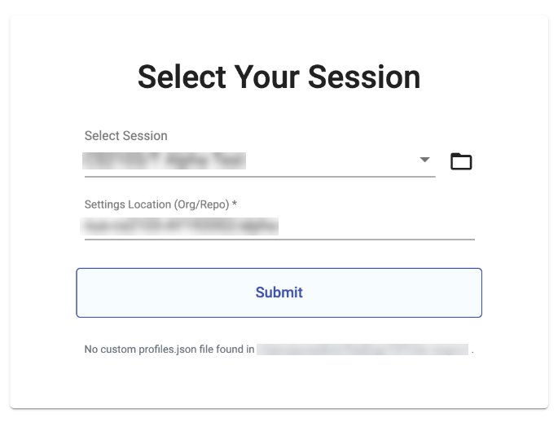

<frontmatter>
  header: header.md
  title: "UG: for students"
  pageNav: 2
  siteNav: ug-nav.md
  footer: footer.md
</frontmatter>

# CATcher User Guide (for students)

---

## Getting started

**The online version of CATcher is available at https://catcher-org.github.io/CATcher**. Alternatively, you can download the [desktop version](https://github.com/CATcher-org/CATcher/releases).

Once the app is launched (either web or desktop version), it will prompt you to enter the session you are participating in, using a dropdown.

 

---

## Using the Web app

The CATcher web app is recommended, and can be accessed at https://catcher-org.github.io/CATcher. Please ensure your browser does not block pop-up windows from our web app.

Ad-blockers may need to be disabled if they block pop-ups.

### Safari users

Pop-up windows are blocked by default on Safari. Before launching CATcher, please enable pop-ups by following the steps below:

1. Go to Preferences > Websites > Pop-up Windows
2. For website `catcher-org.github.io`, choose option `Allow`
   

## Using the desktop app

The latest release of the CATcher desktop app can be downloaded from https://github.com/CATcher-org/CATcher/releases

Start the desktop app by clicking on the executable file; no installation is required.

<tabs>
<tab header="Windows">

For normal usage, you can run the `CATcher.exe` and the following dialog would appear. Simply click on the "More Info" button and then click the "Run Anyway" button which would have appeared on the bottom right corner of the dialog.

In some cases, the "Run Anyway" button may not appear. To troubleshoot this, you can open up "Windows Security" and under "App & browser control", click on "Reputation-based protection settings" and make sure CATcher is not blocked here.

If you are using an older version of Windows, you may not be able to find the "Reputation-based protection settings". Under "App and browser control", you would instead see "Check apps and files". In this section, make sure it is set to "Warn".

</tab>
<tab header="Mac">

To run CATcher on MacOS, you would need to go to "System Preferences" and in "Security & Privacy", select "Open Anyway" for CATcher, as shown below.

### Troubleshooting
1. Copy and pasting images into the text editor for Mac Users

You may find you are not able to copy (Cmd+c) and paste (Cmd+v) an image from the "Preview" application. As a workaround, there are other ways to paste stuff into the text editor such as dragging and dropping a screenshot image or a file.

</tab>
<tab header="Linux">

After downloading the AppImage file, you should be able to run CATcher by clicking on the
AppImage file.
If this does not work, you may need to allow the file to be executed.
There are 2 methods to achieve this:
- From the GUI:
- Right click on the file icon
- Select `Properties`, then select `Permissions`
- Enable the `Allow executing file as program` option.
- Note: the GUI menus may differ slightly on different Linux distributions.
- From the command line: Use `chmod +x CATcher-x.y.z.AppImage`

</tab>
</tabs>
 

##  Reporting problems

If you face any issue in using CATcher, you can create a new issue in [CATcher issue tracker](https://github.com/CATcher-org/CATcher/issues).

If possible, also provide us with the log file saved by CATcher.
* For the web app, logs are saved in your browser and can be retrieved by clicking the "`Download Log`"button.
* For the desktop app, logs can be retrieved from the following directory:
  - Linux: `~/.config/CATcher/logs/*.log`
  - macOS: `~/Library/Logs/CATcher/*.log`
  - Windows: `%USERPROFILE%\AppData\Roaming\CATcher\logs\\*.log`
